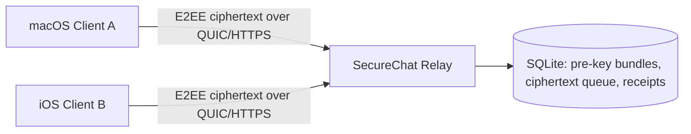

# SecureChat 公共服务器部署指南

这份指南面向一台公开互联网可访问的 relay 服务器。部署完成后，你和朋友的客户端可以把 Relay URL 设置为：

```text
quic://203.0.113.10:443
https://203.0.113.10
quic://chat.example.com:443
https://chat.example.com
```

没有域名也可以直接用服务器公网 IP。推荐优先使用 `quic://...`，在 UDP 被运营商或公司网络阻断时切换到 `https://...`。

## 目标架构



relay 只保存公开 pre-key bundle、离线密文队列和送达/已读回执。消息明文、双棘轮状态、身份私钥和本地消息正文都不进入服务器。

## 准备事项

- 一台 Ubuntu 22.04 或 24.04 LTS 云服务器
- 一个公网 IPv4 地址。域名是可选项，不再强制需要
- 如果有域名，例如 `chat.example.com`，让 DNS `A` 记录指向服务器公网 IPv4
- 云厂商安全组放行：
  - 你的 SSH 端口，通常是 `22/tcp`，否则开启 UFW 后可能把自己锁在服务器外
  - `80/tcp`，仅用于首次签发和续期 Let's Encrypt 证书
  - `443/tcp`，HTTPS relay
  - `443/udp`，QUIC relay
  - `3478/udp`，P2P NAT traversal 的签名 rendezvous 探测
- 服务器上安装 `git`
- 本仓库已能从 GitHub 拉取

云厂商安全组和服务器防火墙都要放行端口。只开 UFW 但云安全组没开，外网仍然访问不到。

## 方式一：一键 systemd 部署

推荐新服务器直接用一键脚本。脚本会安装依赖、安装 Rust、构建 relay、创建 `securechat` 系统用户、自动探测公网 IP、签发 Let's Encrypt 证书、写入 systemd 配置、开启防火墙、安装证书续期 hook 和专用续期 timer，并打开 `3478/udp` 作为签名 P2P rendezvous 端口。后续管理入口会安装为：

```bash
chatrelay
```

部署：

```bash
git clone https://github.com/ninjaz0/secure-chat.git
cd secure-chat
./deploy/install-relay.sh --email you@example.com
```

部署完成后，脚本会直接打印可以填到客户端里的地址，例如：

```text
https://203.0.113.10
quic://203.0.113.10:443
```

如果自动探测公网 IP 失败，也可以手动指定：

```bash
./deploy/install-relay.sh --ip-address 203.0.113.10 --email you@example.com
```

如果你有域名，再使用域名模式：

```bash
./deploy/install-relay.sh --domain chat.example.com --email you@example.com
```

如果你已经手动准备好了 `/etc/secure-chat/tls/fullchain.pem` 和 `/etc/secure-chat/tls/privkey.pem`，可以跳过 Certbot。没有域名时：

```bash
./deploy/install-relay.sh --ip-address 203.0.113.10 --skip-certbot
```

有域名时：

```bash
./deploy/install-relay.sh --domain chat.example.com --skip-certbot
```

部署完成后，服务器上直接输入：

```bash
chatrelay
```

即可打开交互式管理菜单。也可以直接运行：

```bash
chatrelay status
chatrelay logs
chatrelay restart
chatrelay health
chatrelay backup
chatrelay update
chatrelay renew
```

客户端 Relay URL 使用：

```text
quic://203.0.113.10:443
https://203.0.113.10
quic://chat.example.com:443
https://chat.example.com
```

IP 地址证书是短期证书，脚本会安装 `secure-chat-relay-cert-renew.timer` 每 12 小时检查续期。不要关闭 80/tcp，否则证书续期可能失败。

## 方式二：手动 systemd 裸机部署

如果需要完全手动控制每一步，可以按下面的裸机部署流程执行。

### 1. 安装依赖

```bash
sudo apt update
sudo apt install -y build-essential curl git pkg-config libssl-dev certbot ufw sqlite3
```

安装 Rust：

```bash
curl --proto '=https' --tlsv1.2 -sSf https://sh.rustup.rs | sh
source "$HOME/.cargo/env"
rustup default stable
```

### 2. 拉取代码并构建 relay

```bash
git clone https://github.com/ninjaz0/secure-chat.git
cd secure-chat
cargo build --release -p secure-chat-relay
```

### 3. 创建系统用户和目录

```bash
sudo useradd --system --home /var/lib/secure-chat --shell /usr/sbin/nologin securechat || true
sudo install -d -o securechat -g securechat -m 0750 /var/lib/secure-chat
sudo install -d -m 0755 /opt/secure-chat /etc/secure-chat
sudo install -d -o securechat -g securechat -m 0750 /etc/secure-chat/tls
sudo install -m 0755 target/release/secure-chat-relay /opt/secure-chat/secure-chat-relay
```

### 4. 签发 TLS 证书

把 `chat.example.com` 替换成你的真实域名。

```bash
sudo ufw allow 80/tcp
sudo certbot certonly --standalone -d chat.example.com
```

复制证书到 relay 专用目录：

```bash
sudo DOMAIN=chat.example.com ./deploy/copy-letsencrypt-certs.sh
```

### 5. 写入 relay 环境配置

```bash
sudo cp deploy/relay.env.example /etc/secure-chat/relay.env
sudo nano /etc/secure-chat/relay.env
```

生产推荐配置如下：

```env
SECURE_CHAT_RELAY_HTTP_ADDR=127.0.0.1:8787
SECURE_CHAT_RELAY_HTTPS_ADDR=0.0.0.0:443
SECURE_CHAT_RELAY_QUIC_ADDR=0.0.0.0:443
SECURE_CHAT_RELAY_P2P_ADDR=0.0.0.0:3478
SECURE_CHAT_TLS_CERT=/etc/secure-chat/tls/fullchain.pem
SECURE_CHAT_TLS_KEY=/etc/secure-chat/tls/privkey.pem
SECURE_CHAT_RELAY_DB=/var/lib/secure-chat/relay.sqlite3
RUST_LOG=secure_chat_relay=info,tower_http=warn
```

不要把 `SECURE_CHAT_RELAY_HTTP_ADDR` 设成 `0.0.0.0:8787` 暴露到公网，除非你明确知道自己要公开未加 TLS 的诊断端口。

### 6. 安装 systemd 服务

```bash
sudo cp deploy/secure-chat-relay.service /etc/systemd/system/secure-chat-relay.service
sudo systemctl daemon-reload
sudo systemctl enable --now secure-chat-relay
```

### 7. 开启防火墙

```bash
sudo ufw allow 22/tcp  # 如果 SSH 改过端口，把 22 换成实际端口
sudo ufw allow 443/tcp
sudo ufw allow 443/udp
sudo ufw allow 3478/udp
sudo ufw enable
sudo ufw status
```

### 8. 验证公网 HTTPS

```bash
curl -fsS https://chat.example.com/health
```

成功时会看到类似：

```json
{"ok":true,"service":"secure-chat-relay","stores_plaintext":false}
```

### 9. 验证公网 QUIC

在可以访问服务器的机器上运行：

```bash
SECURE_CHAT_SMOKE_RELAY_URL=quic://chat.example.com:443 \
cargo run -p secure-chat-client --bin secure-chat-smoke
```

成功时 JSON 里会有：

```json
{"ok":true,"relay":"quic://chat.example.com:443"}
```

## 方式二：Docker Compose 部署

Docker 适合快速试运行。长期生产仍推荐 systemd，因为证书权限、备份和升级更直观。

先在宿主机签发证书：

```bash
sudo certbot certonly --standalone -d chat.example.com
```

准备 Compose 证书和数据目录：

```bash
mkdir -p certs data
sudo cp /etc/letsencrypt/live/chat.example.com/fullchain.pem certs/fullchain.pem
sudo cp /etc/letsencrypt/live/chat.example.com/privkey.pem certs/privkey.pem
sudo chown -R 10001:10001 certs data
sudo chmod 0644 certs/fullchain.pem
sudo chmod 0600 certs/privkey.pem
docker compose up -d --build
```

验证：

```bash
curl -fsS https://chat.example.com/health
docker compose logs -f relay
```

证书续期后，需要重新复制证书并重启容器。

## 证书自动续期

systemd 部署推荐安装 Certbot deploy hook：

```bash
sudo install -m 0755 deploy/copy-letsencrypt-certs.sh /opt/secure-chat/copy-letsencrypt-certs.sh
sudo tee /etc/letsencrypt/renewal-hooks/deploy/secure-chat-relay >/dev/null <<'EOF'
#!/usr/bin/env bash
set -euo pipefail
DOMAIN=chat.example.com /opt/secure-chat/copy-letsencrypt-certs.sh
systemctl restart secure-chat-relay
EOF
sudo chmod +x /etc/letsencrypt/renewal-hooks/deploy/secure-chat-relay
sudo certbot renew --dry-run
```

## 日常运维

查看状态：

```bash
systemctl status secure-chat-relay
journalctl -u secure-chat-relay -f
```

重启：

```bash
sudo systemctl restart secure-chat-relay
```

备份 SQLite：

```bash
sudo mkdir -p /var/backups
sudo systemctl stop secure-chat-relay
sudo sqlite3 /var/lib/secure-chat/relay.sqlite3 ".backup '/var/backups/secure-chat-relay.sqlite3'"
sudo systemctl start secure-chat-relay
```

升级：

```bash
cd secure-chat
git pull
cargo build --release -p secure-chat-relay
sudo install -m 0755 target/release/secure-chat-relay /opt/secure-chat/secure-chat-relay
sudo systemctl restart secure-chat-relay
```

## 常见问题

### HTTPS 正常，QUIC 不通

检查云安全组和 UFW 是否都放行 `443/udp`：

```bash
sudo ufw status
```

很多公司网络和校园网会阻断 UDP。客户端可以临时切换到：

```text
https://chat.example.com
```

### 日志出现 UnknownIssuer

如果服务器日志里有：

```text
invalid peer certificate: UnknownIssuer
```

含义是客户端不信任服务器发出来的 TLS 证书链，然后主动中止了 QUIC 握手。先在任意可访问服务器的机器上检查公网证书：

```bash
curl -v https://chat.example.com/health
openssl s_client -connect chat.example.com:443 -servername chat.example.com -showcerts </dev/null
```

常见修复：

- 如果部署时用了 `--staging`，这是 Let's Encrypt 测试证书，普通客户端不会信任；重新不带 `--staging` 签发正式证书。
- 确认 `/etc/secure-chat/relay.env` 里的 `SECURE_CHAT_TLS_CERT` 指向 `fullchain.pem`，不要只给 leaf `cert.pem`。
- 如果是自签名或私有 CA 测试，Rust smoke test 可以临时加 `SECURE_CHAT_QUIC_CA_CERT=/path/to/ca.pem`。正式给 macOS/iOS/Android 客户端用，建议换成公开受信任证书。

### Certbot 签发失败

确认 DNS 已生效：

```bash
dig +short chat.example.com
```

确认 80 端口没有被其他服务占用：

```bash
sudo ss -lntp | grep ':80'
```

### 客户端连接失败

先看服务器健康检查：

```bash
curl -v https://chat.example.com/health
```

再看 relay 日志：

```bash
journalctl -u secure-chat-relay -n 200 --no-pager
```

### 收不到离线消息

确认 `SECURE_CHAT_RELAY_DB` 指向持久磁盘，并且服务用户有写权限：

```bash
sudo ls -l /var/lib/secure-chat
sudo -u securechat test -w /var/lib/secure-chat && echo writable
```

## 安全边界

- relay 不保存明文和端到端会话密钥。
- device registration、send、drain、receipt 命令都需要设备 Ed25519 签名。
- public pre-key lookup 仍然开放，这是异步邀请建连所需。
- 还没有第三方安全审计，不要公开宣称“绝对安全”。
- 当前是单机 SQLite 部署，不是多节点高可用架构。
